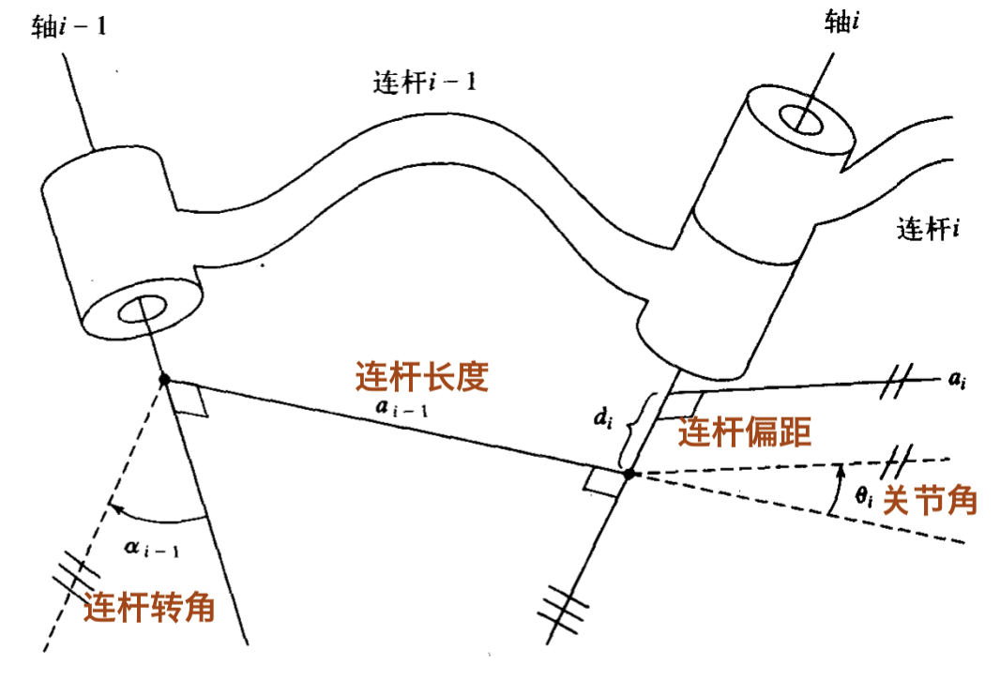
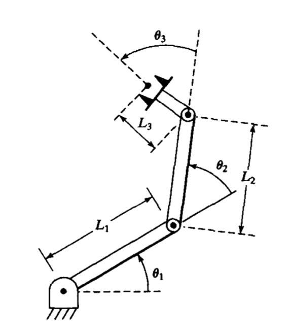
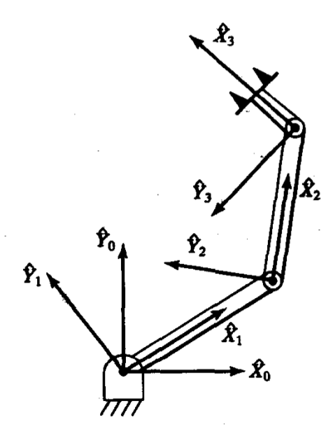

## 概述
顺向运动学研究静止状态下操作臂连杆的位置和姿态，即其运动特性。在顺向运动学中，操作臂关节变量为自变量，操作臂**末端执行器**的位置和姿态与操作臂**基座**之间的函数关系为描述对象。
<!--more-->
## 连杆描述
操作臂可以看成由一系列刚体通过关节连接而成的一个运动链，这些刚体称为**连杆**。  
当两个刚体之间的相对运动是两个平面之间的相对滑动时，连接相邻两个刚体的运动副称为**低副**。  
从操作臂的固定基座开始为连杆编号，可以称固定基座为连杆0，以此类推，最末端的连杆为连杆n。为了确定末端执行器在3维空间的位置和姿态，操作臂至少需要6个关节。
为了确定操作臂两个相邻关节轴的位置关系，可把连杆看作是一个刚体，用空间的直线来表示关节轴。
## 关节轴相对位置
三维空间中的任意两个轴之间的距离均为一个确定值，两个轴之间的距离即为两轴之间公垂线的长度。即为**连杆长度**。两轴之间的夹角为**连杆转角**。这两个参数定义了两个关节轴之间的相对位置。
## 连杆相对位置
描述两个连杆之间的相对位置，需要另外两个参数。第一个是**连杆偏距**，为两个相邻连杆公共轴线方向的距离，记为$d_{i}$。另一个为**关节角**，为两相邻连杆绕公共轴线旋转的夹角，记为$\theta_{i}$。
## Denavit-Hartenberg参数
因此，机器人的每个连杆都可以以四个运动学参数来描述。其中两个参数用于描述连杆本身，另外两个参数用于描述连杆之间的连接关系。通常，对于转动关节，$\theta_{i}$为关节变量，其它三个连杆参数是固定不变的；对于移动关节，$d_{i}$为关节变量，其它三个连杆参数是固定不变的。这种用连杆参数描述机构运动关系的规则称为Denavit-Hartenberg参数。例如，对于一个均为转动关节的6关节机器人，可以用6组$(a, \alpha, d_{i})$共18个参数来描述这些固定的运动学参数。

## 连杆附加坐标系
为了描述每个连杆与相邻连杆之间的相对位置关系，需要在每个连杆上定义一个**固连坐标系**。固连在连杆$i$上的固连坐标系称为坐标系${i}$。
对于一个新机构，可以按照下面的步骤正确地建立连杆坐标系：
1. 找出各关节轴，并标出这些轴线的延长线。
2. 找出关节轴$i$和$i+1$之间的公垂线或关节轴$i$和$i+1$的交点，以关节轴$i$和$i+1$的交点或公垂线与关节轴$i$的交点作为连杆坐标系${i}$的原点。
3. 规定$\hat{Z_{i}}$轴沿关节轴$i$的指向。
4. 规定$\hat{X_{i}}$轴沿公垂线的指向。如果关节轴$i$和$i+1$相交，则规定$\hat{X_{i}}$轴垂直于关节轴$i$和$i+1$所在的平面。
5. 按照右手定则确定$\hat{Y_{i}}$轴。
6. 当第一个关节变量为0时，规定坐标系${0}$和${1}$重合。对于坐标系${N}$，其原点和$\hat{X_{N}}$的方向可以任意选取。选取时通常尽量使连杆参数为0。

下图所示为一个平面三杆操作臂，以及此机构的连杆坐标系与DH参数。

|i|$\alpha_{i-1}$|$a_{i-1}$|$d_{i}$|$\theta_{i}$|
|---|---|---|---|---|
|$1$|$0$|$0$|$0$|$\theta_{1}$|
|$2$|$0$|$L1$|$0$|$\theta_{2}$|
|$3$|$0$|$L2$|$0$|$\theta_{3}$|